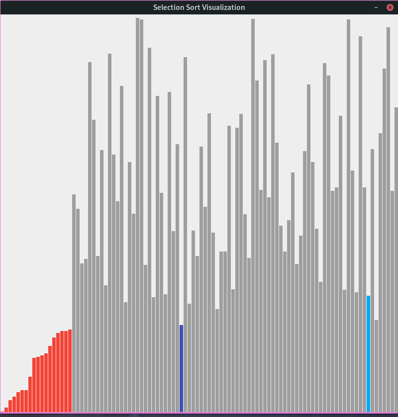

## Selection Sorting 
Here is the main method of Selection Sorting
```java
private void run (){
    
        for(int i=0;i<data.N();i++){
        //寻找[i, n)区间里的最小值的索引
        // Find the index of minimun number in [i, n) 
            int minIndex = i;
            for(int j=i+1;j<data.N();j++){
                if(data.get(j)<data.get(minIndex)){
                    minIndex=j;
                }
        }
            data.swap(i,minIndex);
        }
        }
        public void swap(int i, int j) {

        if( i < 0 || i >= numbers.length || j < 0 || j >= numbers.length)
        throw new IllegalArgumentException("Invalid index to access Sort Data.");

        int t = numbers[i];
        numbers[i] = numbers[j];
        numbers[j] = t;
        }
        
```
### Core Methods Explanation
In order to visualize this process, we need three variables to represent the current state:
- `orderedIndex`: numbers from [0...orderedIndex] are ordered 
- `currentMinIndex`: index of current minimun number
- `currentCompareIndex`: index of current number being compared
We set the initial value of these three numbers to -1.    
During the sorting, once these three numbers have changed, we need to capture that change.
```java
//We use setData method to capture the change in these three numbers
private void setData(int orderedIndex, int currentCompareIndex, int currentMinIndex){
        data.orderedIndex = orderedIndex;
        data.currentCompareIndex = currentCompareIndex;
        data.currentMinIndex = currentMinIndex;

        // To render the graphics
        frame.render(data);
        AlgoVisHelper.pause(DELAY);
        }
private void run(){
        //First we show the initial unsorted state
        // 0: means [0, orderedIndex) == [0, 0) is sorted. Literally no numbers are sorted
        setData(0, -1, -1);
      
        for (int i = 0; i < data.N(); i++) {
            
        // Find the index of minimun number in [i, n)
            int minIndex = i;
            
            //Now orderedIndex, currentMinIndex are correspondingly changed to i, minIndex
            setData(i, -1, minIndex);
            for (int j = i + 1; j < data.N(); j++) {
                
                //Now currentCompareIndex is changed to j because we start comparing
                setData(i, j, minIndex);
                if (data.get(j) < data.get(minIndex)){
                    minIndex = j;
                    //Notice minIndex is changed here
                    setData(i, j, minIndex);
                }
            }
            data.swap(i, minIndex);
            //Now start sorting from index[i+1] because [0...i] is sorted
            setData(i+1, -1, minIndex);
        }
        setData(data.N(), -1, -1);
    }
    
```
<<<<<<< HEAD
### The result

=======
>>>>>>> f62cc48a45b181614b50974f383970dddb6983cc
