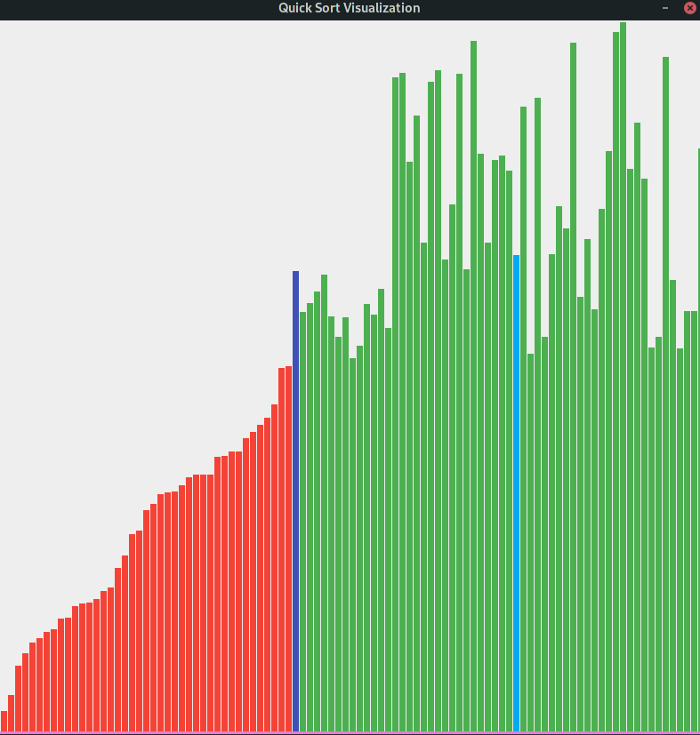

## Result
- The greed part is numbers in the [l...r]partition
- The grey part is instead not in the [l...r]partition
- The bule part is the current pivot number, usually data[l]
- THe lightblue part is the current number being compared
- The red part is sorted numbers, or fixPivot number.

  ## Algo Implementaion
```java
public class Test {

    public static void main(String[] args) {
        int[] nums = {8, 7, 6, 5, 4, 2, 9, 1, 10};
        quickSort(0, nums.length-1, nums);
        for (int i : nums){
            System.out.print(i + " ");
        }

    }
    public static void quickSort(int l, int r, int[] arr){
        if( l > r) return;
        int p = partition(l, r, arr);
        quickSort(l, p-1, arr);
        quickSort(p+1, r, arr);

    }
    public static int partition(int l, int r, int[] arr){
        //Variable v is the current pivot number
        int v = arr[l];
        int j = l;

        for (int i = l + 1 ; i <= r ; i++) {
            if(arr[i] < v){
                j++;
                Test.swap(j, i, arr);
            }
        }
        Test.swap(l, j, arr);
        //j is the fixed pivot number
        return j;
    }
    public static void swap(int i, int j, int[] arr) {

        if( i < 0 || i >= arr.length || j < 0 || j >= arr.length)
            throw new IllegalArgumentException("Invalid index to access Sort Data.");

        int t = arr[i];
        arr[i] = arr[j];
        arr[j] = t;
    }
}

```