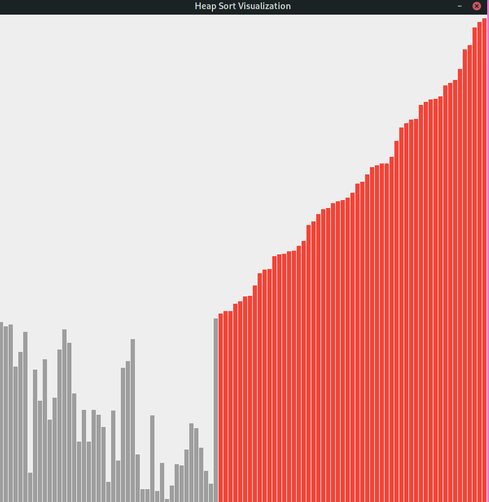

## Result
- The red part is sorted
- The grey part is in the heap

  ## Algo Implementation
- Build a MaxHeap from array using shiftdown
- Heap Sort
```java
public class Test {
    public static void main(String[] args) {
        int[] arr = {100, 23, 13, 4, 5, 12, 78, 3,9};
        MaxHeap(arr);
        HeapSort(arr);
        for (int i :arr){
            System.out.print(i + " ");
        }
    }
    public static void HeapSort(int[] arr){
        int n  = arr.length;
        for (int i = n-1; i > 0; i--) {
            swap(0,i,arr);
            shifDown(0, i, arr);
        }

    }
    public static void MaxHeap(int[] arr){
        int n = arr.length;
        for (int i = (n-1)/2; i >= 0; i--) {
            shifDown(i, n, arr);
        }
    }
    public static void shifDown(int k, int n, int[] arr){
            //Index starts from 0
            // node's index: (i-1)/2
            // left child index: 2*i+1
            //right child index: 2*i+2
            while( 2*k+1 < n){
                int j = 2*k+1;
                if( j+1 < n && arr[j+1] > arr[j] ){
                    j += 1;
                }
                if(arr[k] >= arr[j]) break;
                swap(k, j, arr);
                k = j;
            }
    }
    public static void swap(int i, int j, int[] arr) {

        if( i < 0 || i >= arr.length || j < 0 || j >= arr.length)
            throw new IllegalArgumentException("Invalid index to access Sort Data.");

        int t = arr[i];
        arr[i] = arr[j];
        arr[j] = t;
    }

}

```